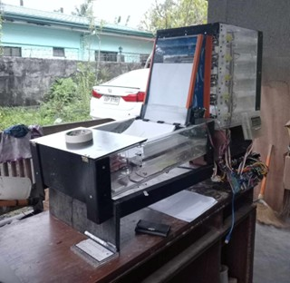
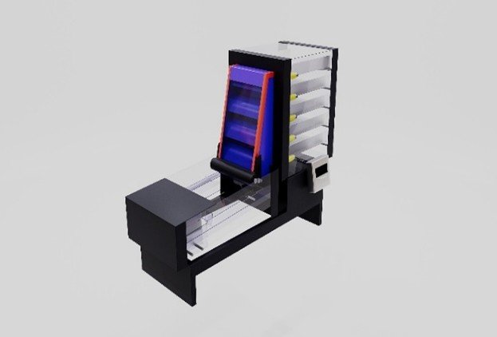
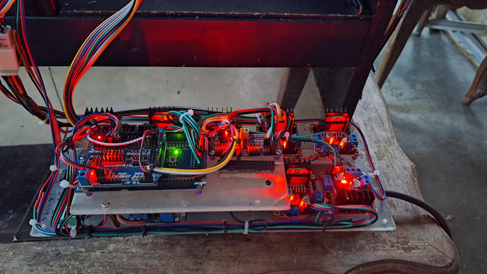
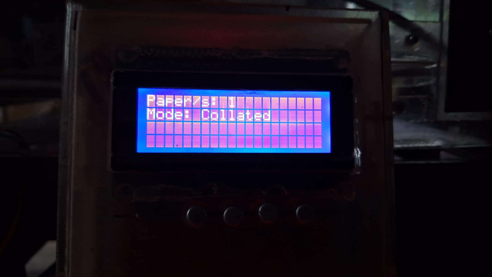
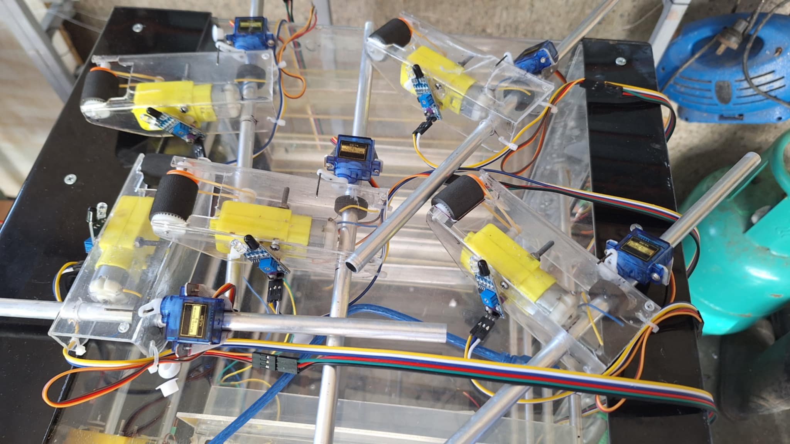

  <h1>📄 Advanced Automated Collating and Stapling Mechanism</h1>
  <h3>Mechatronics & Office Automation Prototype</h3>

  

    An electromechanical system designed to streamline document preparation by  
    automating the sorting, aligning, and stapling of multi-page documents.
  

  

    
    
    
    
  

  

 

## 📌 Overview

The **Advanced Automated Collating and Stapling Mechanism** was developed to address the time-consuming and repetitive task of manual document collation in high-volume office environments, specifically targeted for the General Services Office (GSO) of UST-Legazpi.

This prototype automates the entire workflow: dispensing individual sheets from multiple bins, transporting them via conveyor, aligning the stack, and stapling the final set. By integrating sensor-based feedback and robust motor control, the system significantly reduces human error and processing time.

---

## 🎯 Key Features

| Feature | Description |
| :--- | :--- |
| **📑 Multi-Bin Dispensing** | Three separate input bins capable of dispensing sheets sequentially to form a complete document set. |
| **⚙️ Conveyor Transport** | A belt-driven mechanism powered by DC gear motors that transports papers smoothly from bins to the staging area. |
| **📏 Auto-Alignment** | Mechanical arms that automatically align the loose papers into a neat stack before stapling. |
| **📎 Automated Stapling** | A high-torque servo mechanism that triggers a stapler once the document set is verified as complete. |
| **🚨 Error Detection** | Integrated IR and Ultrasonic sensors to detect paper jams, empty bins, or misalignment in real-time. |
| **📟 LCD Status Monitor** | A 20x4 LCD screen that provides live feedback on the current operation status (e.g., "Collating", "Stapling", "Error"). |

---

## 🧠 System Architecture

The system is controlled by an **Arduino Mega 2560**, which handles the logic for synchronizing multiple motors and reading sensor data.

### 🛠️ Hardware Components

| Component | Function |
| :--- | :--- |
| **Arduino Mega 2560** | The main microcontroller unit (MCU) managing all IOs. |
| **IR Sensors (E18-D80NK)** | Detects the passage of paper and obstacles to ensure correct dispensing. |
| **Ultrasonic Sensors (HC-SR04)** | Monitors the stack height and presence of paper in bins. |
| **DC Gear Motors** | Provides high torque for the conveyor belt and paper rollers. |
| **L298N Motor Drivers** | Controls the direction and speed of the DC motors. |
| **MG996R Servo Motors** | Actuates the alignment arms and the stapling mechanism. |
| **LCD 20x4 Display** | User interface for system status and troubleshooting. |
| **Power Supply (12V 30A)** | Provides stable power for the motors and microcontroller. |

---

## 📸 Project Gallery

<table>
  <tr>
    <td width="50%">
      <h3 align="center">Internal Mechanism</h3>
      
    </td>
    <td width="50%">
      <h3 align="center">Circuitry & Logic</h3>
      
    </td>
  </tr>
  <tr>
    <td width="50%">
      <h3 align="center">LCD Interface</h3>
      
    </td>
    <td width="50%">
      <h3 align="center">Motor Assembly</h3>
      
    </td>
  </tr>
</table>

---

## 💻 Software & Tools Used

* **IDE:** Arduino IDE (C++)
* **3D Modeling:** SketchUp (for chassis and printed parts)
* **Slicing:** Ultimaker Cura
* **Circuit Design:** Fritzing

---

## 👥 Authors

**Lance Madel S. Esureña** & **Mar Joefrey M. Calleja**
 
*Bachelor of Science in Computer Engineering*
 
*University of Santo Tomas - Legazpi*

---

  
Developed by <b>Lance Esureña</b>

  

    
    
  

